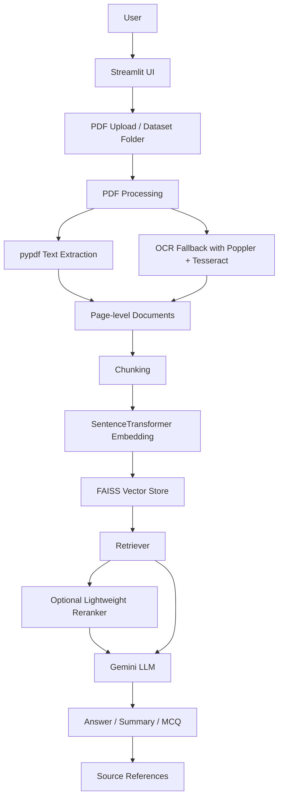

# Architecture Diagram

```mermaid
flowchart TD
    User[User]
    UI[Streamlit UI]
    Upload[PDF Upload / Dataset Folder]
    Processing[PDF Processing]
    PyPDF[pypdf Text Extraction]
    OCR[OCR Fallback with Poppler + Tesseract]
    Pages[Page-level Documents]
    Chunking[Chunking]
    Embedding[SentenceTransformer Embedding]
    FAISS[FAISS Vector Store]
    Retriever[Retriever]
    Reranker[Optional Lightweight Reranker]
    Gemini[Gemini LLM]
    Output[Answer / Summary / MCQ]
    Sources[Source References]

    User --> UI
    UI --> Upload
    Upload --> Processing
    Processing --> PyPDF
    Processing --> OCR
    PyPDF --> Pages
    OCR --> Pages
    Pages --> Chunking
    Chunking --> Embedding
    Embedding --> FAISS
    FAISS --> Retriever
    Retriever --> Reranker
    Reranker --> Gemini
    Retriever --> Gemini
    Gemini --> Output
    Output --> Sources
```
